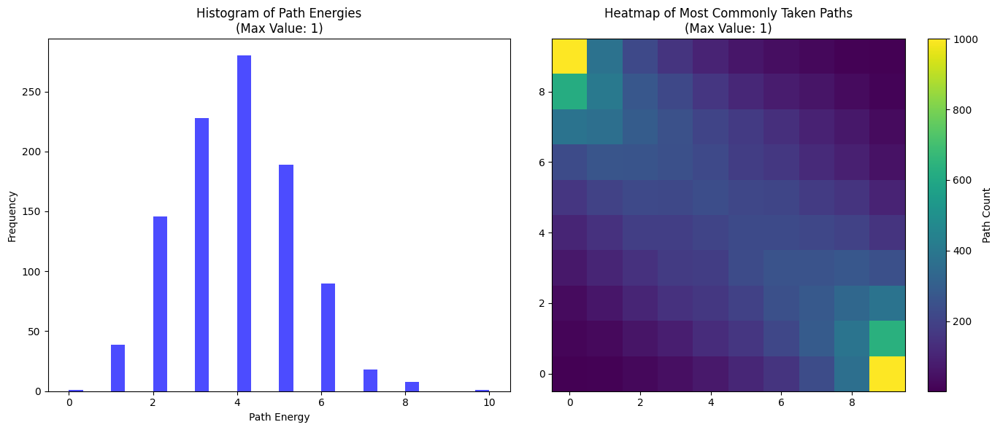
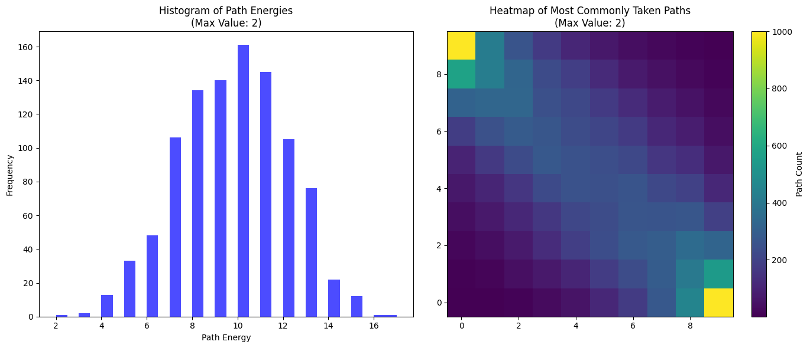
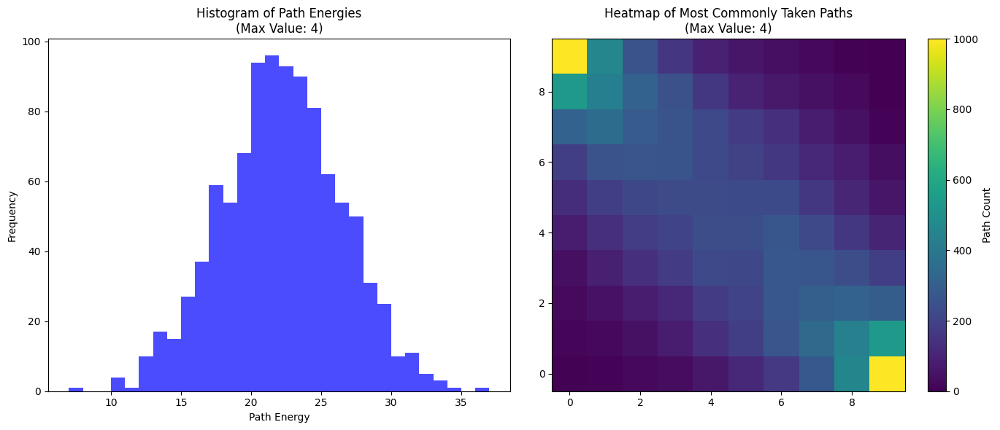

# random-lattice-travel
What happens when you travel across a random lattice? By random lattice I mean an (i, j) grid where there is a random number associated with each grid point. I chose the random numbers to be (0, 1), (0, 1, 2), (0, 1, 2, 3) etc. chosen from a random uniform distribution. The program traverses the lattice graph for many different random initializations and we can see that the best paths are "on average" near the diagonal. If there was no randomness the diagonal would be the best choice, but because the graph edges are randomized it causes some deflections from the usual path.

## Edges randomly set to (0, 1)

## Edges randomly set to (0, 1, 2)

## Edges randomly set to (0, 1, 2, 3)

## Edges randomly set to (0, 1, 2, 3, 4)

